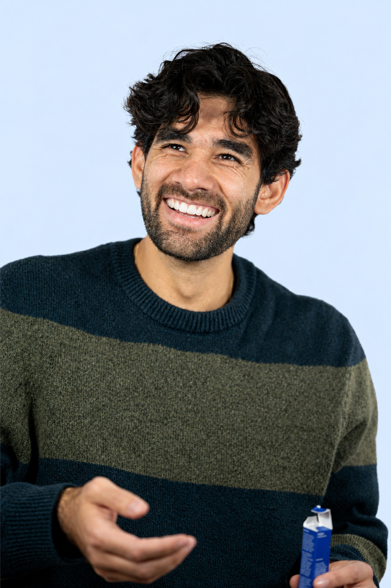

Product Requirements Document (PRD): Pacific Dental Clinic Dr Bedjaoui

1. Executive Summary

Pacific Dental Clinic Dr Bedjaoui, located in Saïd Hamdine, Algiers, is a modern dental practice dedicated to providing high-end, comfortable, and patient-centric care. The website reflects the clinic's exceptional reputation (5.0-star rating), builds immediate trust, reduces patient dental anxiety, and streamlines online appointment booking and patient inquiries. the site should be all in frensh , focus in frensh and add an arabic language to switch in the nav bar.

2. Business & Location Profile

Clinic Name: Pacific Dental Clinic Dr Bedjaoui

Lead Practitioner: Dr. Bedjaoui

Address: Cité Saïd Hamdine, Les Logts 384, Bt 02 N03, 16000 Algiers, Algeria

Phone Contact: 0559 05 38 79

Working Hours: Saturday – Thursday (9:00 AM – 5:00 PM), Friday Closed.

Reputation: Highly rated (5.0 stars based on 40+ patient reviews), known for professional care, modern equipment, and a welcoming atmosphere.

3. Target Audience & Brand Persona

Target Audience: Local residents, families, and individuals in Algiers seeking routine, cosmetic, or specialized dental care who value transparency, top-tier hygiene, and gentle treatment.

Brand Voice & Vibe: Clean, calm, fresh, professional, and weightless.

4. Design System & Visual Guidelines

A. Color Palette

The color scheme is designed to evoke tranquility, clinical cleanliness, and modern wellness.

Role

Color Name

Hex Code

UI Application

Primary

Ethereal Sky Blue

#3B82F6

Brand titles, primary icons, major structural headers

Secondary

Clear Aqua Mint

#06B6D4

Primary action buttons ("Prendre RDV", "Réserver"), interactive highlights

Accent

Pure Soft Sage

#10B981

Success states, 5-star trust badges, gentle health markers

Background

Crisp Air White

#F8FAFC

Spacious section backdrops, airy layout wrappers

Text

#10284b

Body paragraphs, secondary descriptions (easy on the eyes)

B. Typography System

Clean geometric and highly readable sans-serif typefaces to maintain a modern yet warm atmosphere.

Headings (Titles & Sections): Outfit (Weights: 500, 600, 700)

Google Fonts Import: <link href="https://fonts.googleapis.com/css2?family=Outfit:wght@500;600;700&display=swap" rel="stylesheet">

Body Text (Paragraphs & UI): Inter (Weights: 400, 500)

Google Fonts Import: <link href="https://fonts.googleapis.com/css2?family=Inter:wght@400;500&display=swap" rel="stylesheet">

5. UI/UX Wireframe & Section Architecture

The website follows a single-page landing architecture structured into distinct, high-converting sections based on approved wireframe sketches:

Section 1: Header / Navigation Bar

Left: Clinic Logo https://maps.app.goo.gl/YdR7835dCi6A7JXo6.

Center Links: Accueil, Nos traitements, Témoignages, Contact.

Right Action: Pill-shaped primary button Prendre RDV linked directly to the booking section.

Section 2: Hero Section

Left Column:

Main Headline: "Votre sourire, entre les mains d'experts"

Sub-headline: "short text containg attractive sentences to attract costumers"

Supporting introductory paragraph.

Right Column: High-quality smiling patient image .

Section 3: Trust Bar & About Section , from now on each section should have a title have the name of the section with a small font and color diffrent from the main text

Trust Indicators Bar:(sould move from left to right all acrosse over the screen)

5/5 sur Google (with star badge and google logo)

x ans d'expérience + icon

Paiement par facilité (Easy installments) + icon

1 ere dentiste en Saïd Hamdine + num1 icon

About Snippet (À propos): Concise clinic mission statement emphasizing gentle and professional patient care.

Section 4: Treatments Grid (Nos traitements)(shuld be able to scroll all the treatements from left to right)

Layout: Responsive card have an img with light blue background and in the bottom the name of the service and a shourt brief and an arrow round btn to redirect the rdv section ,featuring core services (Facette Dentaire, Invisalign, Couronne sur Implant, L'Implantation Dentaire,) thire imgs have the same name
each one should have a small definition in the bottom.

Section 5: Real Results (Résultats réels - Before & After)

Layout: containers have 2 imgs before and after, the default case should be half an img before and half an img after separated by middle line move to the left to show more of the after img and to the right to show the before ,Avant (Before) and Après (After) to showcase clinical treatment outcomes.
here are the imgs for it : https://maps.app.goo.gl/U2uGbyvxsngHxcPL7
https://maps.app.goo.gl/iADpap6Bzd9b8PPh6

Section 6: Patient Testimonials (Témoignages de nos patients)

Layout: Patient review cards featuring star ratings (★★★★★), patient names, and comments.

they should be a 2 wide sections ,
first section: contain a cards all the same dementions have the content of the comment , and in the btm an google logo and a 5 stare rating and a name of the person commented

section 7: notre clinique section:
grid layout to show the imgs of the clinique.
the main big pic when hover show the rest of the imgs one by one.(https://maps.app.goo.gl/NcFYkUwmTwLctNmXA)

Interactive Behavior: when hover on each img the a shade in the bottom (gray) appear and fade away graduatly in the top of the img, this allow to appear a text in the btm of the img.
these are the rest imgs https://maps.app.goo.gl/g8MW2XanoFz146SG9
https://maps.app.goo.gl/V1E4aLcQMGqjuLmz7
https://maps.app.goo.gl/MtuagvSfF7DjB3J77
https://maps.app.goo.gl/YTVsB4vDNDH8NJYKA
https://maps.app.goo.gl/hwTqkBFuiuP6YNGP9

Section 8: Appointment & Location Section (Rendez-vous)

Left Column (Location & Contact):

Section title: Notre adresse

Direct contact info: Telephone (0559 05 38 79) and Working Hours (Saturday - Thursday, 9:00 AM - 5:00 PM).

Right Column (Booking Form):

Input fields: Nom complet (Full Name), Numéro de téléphone (Phone), La date souhaitée (Date), and Message (optionel).

Submission Button: Réserver styled in Clear Aqua Mint.
Section 9: Où nous trouver
add a location text as a title
and Embedded interactive Google Map placeholder (MAPS).

Section 10: Footer

Columns: Logo Clinique summary, Quick Links (Liens rapides), and full Contact details.

Bottom Bar: Copyright notice and web developer credit.

6. Technical & Accessibility Constraints

Responsive Design: Fully fluid and optimized for mobile devices, tablets, and desktop viewports.

Accessibility (a11y): High contrast ratios maintained between Soft Ocean Slate (#10284b) text and Crisp Air White (#F8FAFC) backgrounds.
